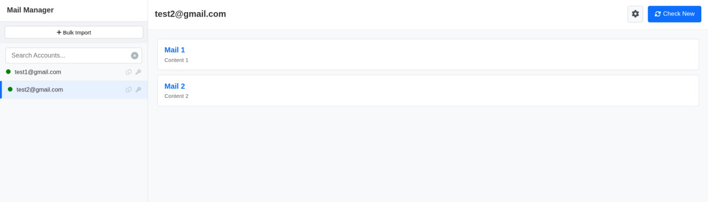
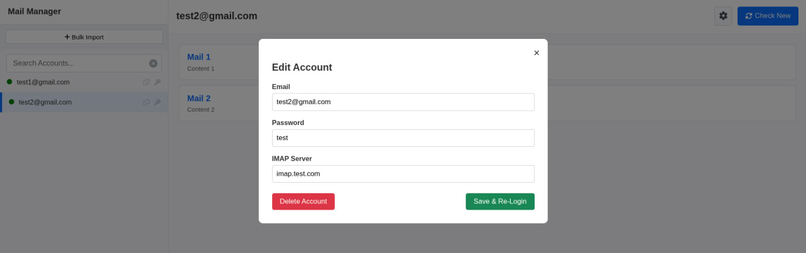

# 📧 Mass Mail Manager

  

**Mass Mail Manager** is a streamlined, lightweight IMAP client designed for users who need to manage, monitor, and organize multiple email accounts from a single interface. Built for efficiency, it allows for bulk importing of credentials and quick switching between accounts without the bloat of traditional email clients. 

**Accounts require enabled IMAP**

---

## 📸 Screenshots

| Dashboard View | Account Editing |
|:---:|:---:|
|  |  |
| *Manage multiple inboxes side-by-side* | *Configure custom IMAP settings* |

---

## ✨ Key Features

### 🚀 Bulk Account Management
- **Bulk Import:** rapidly add hundreds of accounts using simple `email:pass` syntax.
- **Unified Sidebar:** View all loaded accounts in a scrollable sidebar with instant search filtering.
- **Status Indicators:** Visual cues (Green/Red dots) to instantly see connection health.

### 📬 Inbox Control
- **Direct IMAP Integration:** Connects directly to mail servers (Gmail, custom domains, etc.) via IMAP.
- **Quick View:** Read emails in a simplified list view.
- **Manual Refresh:** Force check for new emails with a single click.

### ⚙️ Configuration
- **Custom IMAP Servers:** Fully editable host endpoints for non-standard email providers.
- **Account CRUD:** Easily Edit, Delete, or Re-login to individual accounts.

---

## 🐳 Quick Start (Docker)

The fastest way to get running is via Docker Compose. This will set up the application and the required MySQL database automatically.
1. **Clone the repository**
   ```bash
    git clone https://github.com/arturght06/massmailclient.git
    cd massmailclient
    ```

2. **Run the Application**
    ```bash
    docker-compose up -d
    ```


---

## 🔮 Roadmap & Future Features

We are actively working on scaling this tool for high-volume usage. Upcoming features include:

* [ ] **Proxy Support:** Assign unique SOCKS5/HTTP proxies per account to prevent IP bans.
* [ ] **Threaded Views:** Better visualization for email conversations.
* [ ] **Headless Mode:** Background checking for new emails with system notifications.
* [ ] **Export Functionality:** Export valid/invalid account lists.

---

## 🤝 Contributing

Contributions, issues, and feature requests are welcome!

1. Fork the Project
2. Create your Feature Branch (`git checkout -b feature/AmazingFeature`)
3. Commit your Changes (`git commit -m 'Add some AmazingFeature'`)
4. Push to the Branch (`git push origin feature/AmazingFeature`)
5. Open a Pull Request

---

## ⚠️ Disclaimer

This tool is intended for legitimate email management purposes (e.g., QA testing, managing personal domains). The developers are not responsible for any misuse of this software for spamming or violating email provider Terms of Service.

